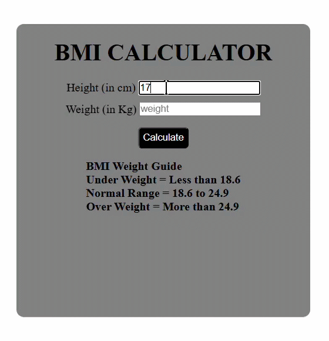

# BMI Calculator

## 📌 Description

A simple BMI (Body Mass Index) Calculator built using HTML, CSS, and JavaScript. The application calculates BMI based on the user's height and weight inputs and categorizes the result as Underweight, Normal Weight, or Overweight.

The interface also displays the BMI ranges for each category, helping users better understand their result.

## ✨ Features

* Calculate BMI using height and weight inputs
* Instant result display
* BMI category classification
* BMI reference ranges displayed on the page
* Simple and user-friendly interface

## 🛠️ Technologies Used

* HTML5
* CSS3
* JavaScript

## ⚙️ How to Run

1. Clone the repository:

   ```bash
   git clone https://github.com/Aashu-Goswami/BMI-Calculator.git
   ```

2. Launch `index.html` in your preferred web browser.

## 🧠 Concepts Practiced

* Form Handling
* DOM Manipulation
* Event Handling
* JavaScript Calculations
* User Input Validation

## 🎥 Preview

```md

```

## 🎯 Learning Purpose

This project was created to practice JavaScript fundamentals, user input handling, and dynamic content updates in the browser.

## 👤 Author

Aashu Goswami
